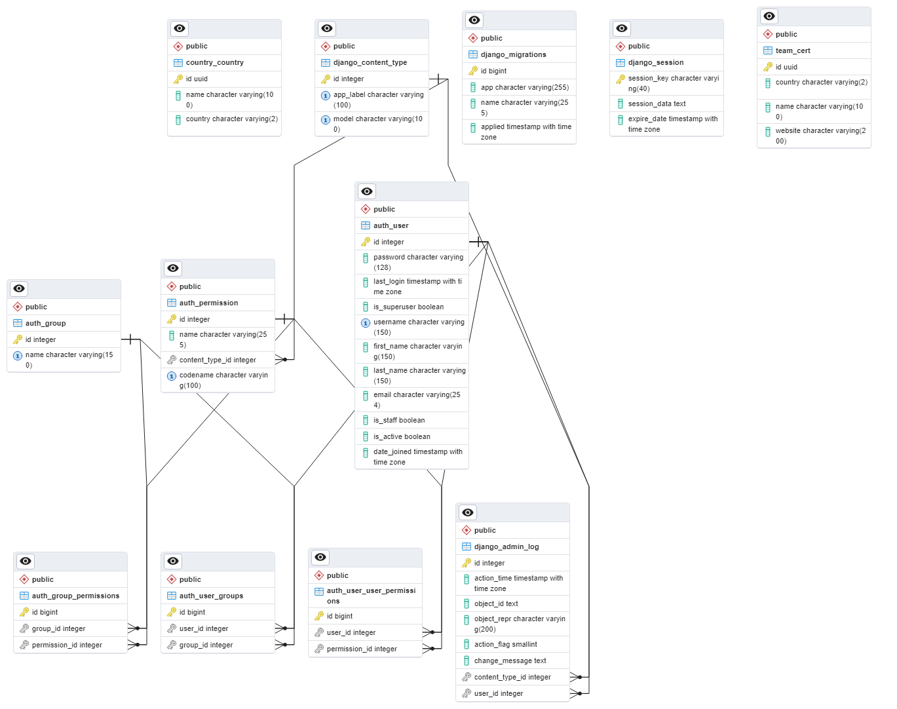

# CSIRTs in Africa Interactive Map

This project involves creating an interactive map to display information about Computer Security Incident Response Teams (CSIRTs) in Africa. The main components are:

- Backend API built with Django REST Framework
- PostgreSQL database 
- Frontend web app with React
- Interactive map visualization using Leaflet
- Docker deployment

## Usage

The API and frontend are containerized using Docker for easy deployment. 

To start locally:

```
docker-compose up --build
```

The frontend will be available at https://csirt-fe.vercel.app/ and the API at https://csirt-be.onrender.com/.

The API provides endpoints for CRUD operations on the CSIRT data. The frontend calls these endpoints to fetch data and displays an interactive map populated with CSIRT location markers. Users can click on a country on the map and then a marker with the country name and response teams there.

## Code Repositories
1. https://github.com/Nkbtemmy/CSIRT-Backend
2. https://github.com/Nkbtemmy/CSIRT-Frontend

## API Documentation

The API is documented using Swagger. The documentation can be viewed at:

https://csirt-be.onrender.com//docs

## Deployment

The containers are set up for deployment to a cloud provider. Configure the appropriate deployment steps:

- Push images to a registry like Docker Hub
- Deploy containers to a host like OnRender and Vercel

## Frontend Details

The frontend uses:

- React with create-react-app
- React Router for navigation 
- Leaflet and React Leaflet for mapping

Components:

- MapView - Renders the Leaflet map

## Backend Details 

The Django REST Framework backend provides a REST API with:

- Django model for CSIRT information
- Serializers to convert model to JSON
- CRUD views for Create, Read, Update, Delete operations


The PostgreSQL database is managed using Django's ORM.


## Future Improvements

Some potential ways to expand on the project:

- Add user registration and accounts
- Support más multiple map views like clusters
- Integrate with GeoDjango for advanced GIS features
- Add additional data and filters like services, contacts, etc

## ERD Diagram for model


